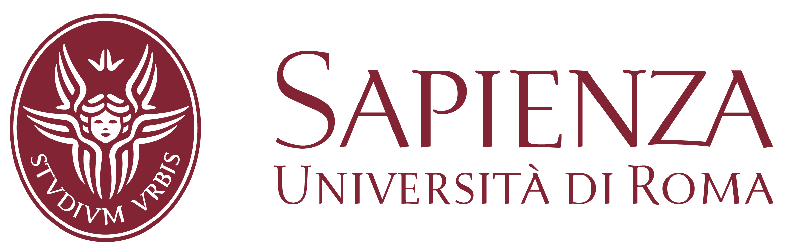
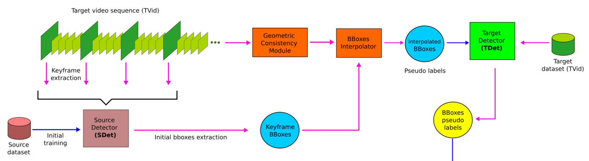
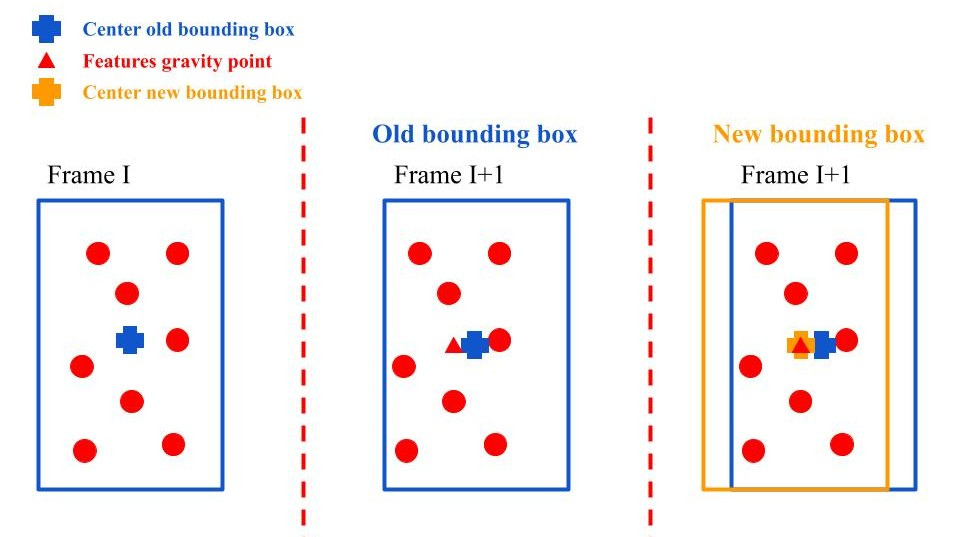
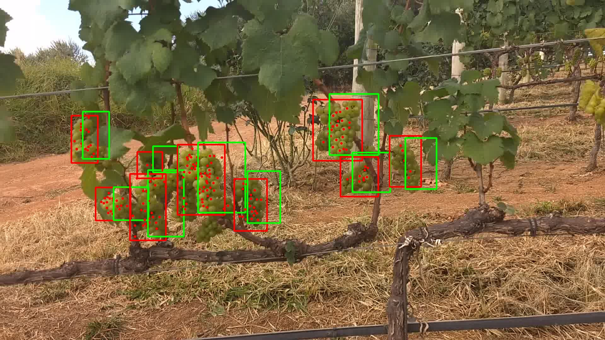

# <strong> GraphTracking </strong> 

<p>


</p>

Master thesis of Leonardo Saraceni at Sapienza University of Rome in collaboration with Canopies Project.
    

* Tracking algorithm which exploits:
    * detection information (images and bounding boxes)
    * 3D information from Structure from Motion (SfM) using COLMAP
* Pseudo-labels generation for semi-supervised learning pipeline levaraging:
    * SURF feature extractor (provided by OpenCV)
    * 3D information from Structure from Motion (SfM) using COLMAP

The <strong> paper </strong> can be obtained to the following link:
https://openaccess.thecvf.com/content/CVPR2022W/AgriVision/html/Ciarfuglia_Pseudo-Label_Generation_for_Agricultural_Robotics_Applications_CVPRW_2022_paper.html

This repository contains the code for the Upper Branch of the system discussed in the paper, the one concerned about the detection, tracking and generation of pseudo-labels from videos. The pipeline contained in this repository is represented by the following schema:

<p float="left">
    
</p>

## <strong> Installation: </strong>

To test the tool is necessary to clone this repository and to install the required dependencies.

* ### <strong> Python dependencies: </strong>
    To install the python dependencies is sufficient to execute the following command:
    ```
    pip3 install -r requirements.txt
    ```

* ### <strong> OpenCV: </strong>
    It is necessary to install the compiled version of OpenCV from source, in order to enable the NON-FREE algorithms, like the <em>xfeatures2d</em> package which contains the SURF features extractor used in this project. Refer to the follwing link for the instructions:
    https://docs.opencv.org/3.4/d7/d9f/tutorial_linux_install.html

    What worked for me (but may not work for you) was to compile using the following CMAKE flags:
    ```
    cmake -D CMAKE_BUILD_TYPE=RELEASE
        -D CMAKE_INSTALL_PREFIX=/usr/local
        -D INSTALL_C_EXAMPLES=ON
        -D INSTALL_PYTHON_EXAMPLES=ON
        -D OPENCV_GENERATE_PKGCONFIG=ON
        -D OPENCV_ENABLE_NONFREE=ON
        -D OPENCV_EXTRA_MODULES_PATH=~/opencv_build/opencv_contrib/modules
        -D BUILD_EXAMPLES=ON
        -D PYTHON3_PACKAGES_PATH=/usr/lib/python3/dist-packages ..
    ```

* ### <strong> COLMAP: </strong>
    Refer to the following link for the installation of COLMAP:
    https://colmap.github.io/install.html

    COLMAP is not strictly necessary to use the tool, since it simply provides a Structure from Motion (SfM) reconstruction of the scene obtained by the videos, as <em>.txt</em> files. Therefore is also possible to use other methods to build the SfM model as a <em>.txt</em> file, but the one I strongly reccomend is COLMAP. The instructions on how to extract the model from a sequences of images is given to the following link:
    https://colmap.github.io/tutorial.html


## <strong>Demo</strong>:

We provide some small demo to generate pseudo-labels from the features extracted by SURF or from the SfM algorithm (COLMAP), together with a demo of the tracker. The images together with the detection labels extracted using YOLOv5 are saved in the <em>./Datasets/dataset_name/Detection</em> folder, while the 3D models are in the <em>./Datasets/dataset_name/ModelText</em> folder. In order to run the tracker demo please use the command:

```
python3 Bboxes_Tracker.py
```

To run the pseudo-labels generation demo using the features extracted by SURF use the command:

```
python3 Generate_Features_Labels.py
```

To run the pseudo-labels generation demo leveraging the Structure from Motion (SfM) information use:
```
python3 Generate_SfM_Labels.py
```

We provide a total of 3 demo datasets, by default the commands will use the <em>Validation</em> one. If you want to test the other two, namely <em>Santos</em> and <em>Test</em> is necessary to change the paths in the configuration files in the <em>./Config/</em> folder. In particular modify <em>./Config/config_track.yaml/</em> for the tracker, <em>./Config/config_features_labels.yaml/</em> for the pseudo-labels generator with SURF features, while for the one with SfM is necessary to modify <em>./Config/config_sfm_labels.yaml</em>.

## <strong>Scripts</strong>:
In this section we provide a brief explaination of the main scripts contained in this repository, to give a general idea of their usage.
* ### <strong>Bboxes_Tracker:</strong> 
    Tracking algorithm for grape instances. It requires a SfM model of the scene and the predictions obtained by a detector (YOLO in the case of this project). The SfM model Need to modify the configuration file in <em>./Config/config_track.yaml/</em> with the paths required by your project.

    ```
    python3 Bboxes_Tracker.py
    ```

    The tracker is able to assign the same ID to the same instances in different frames, as visually explained by the images.

    <p float="left">
    
     
    </p>

* ### <strong>Generate_Features_Labels:</strong>
    Algorithm to automatically generate the pseudo-labels to finetune the detector on the target set, using the features extracted using SURF. It requires the prediction of the detector to finetune (YOLO format), and to have installed OpenCV by compiling him to support also the non-free features, as explained in the previous section. To test the script for your project please modify the configuration file in <em>./Config/config_features_labels.yaml/</em> with the paths coherent with your application.

    ```
    python3 Generate_Features_Labels.py
    ```

    The features are generated by propagating the bounding boxes from the current frame to the next <strong>n</strong> ones, where <strong>n</strong> is the value to be setted in the configuration file (by default 2 and 5). In particular the propagation happens by matching the features inside the bounding box at a given frame with the ones in the next frames, and moving the annotation to the center of gravity of the new features, as shown in the following schema.

    <p float="left">
    
    </p>

* ### <strong>Generate_SfM_Labels:</strong> 
    Algorithm to automatically generate the pseudo-labels to finetune the detector on the target set. It requires the prediction of the detector to finetune (YOLO format) and a 3-D model (txt model) of the environment generated by COLMAP, a SfM framework that given a sequence of frames returns the 3D reconstruction of the environment.
    Is necessary to modify the configuration file in <em>./Config/config_sfm_labels.yaml</em> with the paths required by your project.

    ```
    python3 Generate_SfM_Labels.py
    ```

    The process of generation of the pseudo labels happens in analogous way to the one described in the previous section, but in this case the features are not computed by 2D extractors, but by the Structure From Motion algorithm, and therefore are 3D. The image shows in green the proposal bounding boxes that are moved to the center of gravity of the features, generating the red bounding boxes 

     
